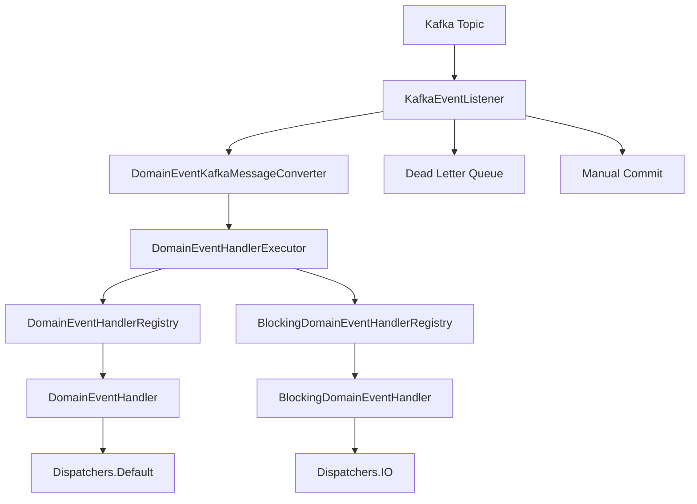

# Kafka Event Consumer

Apache Kafka를 기반으로 한 도메인 이벤트 컨슈머 모듈입니다.

## 📋 개요

이 모듈은 **ball-framework**의 Hexagonal Architecture 패턴에 따라 구현된 Kafka 이벤트 컨슈머입니다. 
`messaging-consumer-core` 모듈의 공통 로직을 재사용하여 Kafka 특화된 기능을 제공합니다.

## 🚀 주요 기능

- **Apache Kafka 기반** 도메인 이벤트 수신
- **Core 모듈 공통 로직** 재사용 (Registry, Executor, Properties)
- **Suspend/Blocking 핸들러** 모두 지원
- **자동 메시지 변환** (JSON ↔ DomainEvent)
- **수동 오프셋 커밋**으로 메시지 손실 방지
- **Dead Letter Queue** 지원
- **병렬 처리** 및 동시성 제어
- **재시도 메커니즘** 및 에러 핸들링
- **Spring Boot Auto Configuration**

## 📦 의존성

### Gradle

```kotlin
dependencies {
    implementation("io.clroot.ball:messaging-consumer-kafka:2.0.0-SNAPSHOT")
}
```

### Maven

```xml
<dependency>
    <groupId>io.clroot.ball</groupId>
    <artifactId>messaging-consumer-kafka</artifactId>
    <version>2.0.0-SNAPSHOT</version>
</dependency>
```

## ⚙️ 설정

### application.yml

```yaml
ball:
  event:
    consumer:
      kafka:
        enabled: true
        # 공통 설정 (core 모듈에서 상속)
        async: true
        parallel: true
        maxConcurrency: 10
        timeoutMs: 30000
        enableRetry: true
        maxRetryAttempts: 3
        retryDelayMs: 1000
        
        # Kafka 전용 설정
        topics:
          - "domain-events"
          - "user-events"
        groupId: "ball-framework"
        bootstrapServers: "localhost:9092"
        autoOffsetReset: "earliest"
        enableAutoCommit: false
        maxPollRecords: 500
        concurrency: 3
        enableDlq: true
        dlqTopic: "domain-events-dlq"
        
        # Kafka 세부 설정
        fetchMinBytes: 1
        fetchMaxWaitMs: 500
        sessionTimeoutMs: 30000
        heartbeatIntervalMs: 3000
        maxPollIntervalMs: 300000
        
        # 에러 핸들링
        kafkaErrorHandling:
          commitRetryAttempts: 3
          commitRetryDelayMs: 100
          rebalanceTimeoutMs: 30000
          consumerRestartDelayMs: 5000
```

## 🎯 사용법

### 1. 기본 활성화

모듈을 의존성에 추가하면 **자동으로 활성화**됩니다.

```kotlin
@SpringBootApplication
class MyApplication

fun main(args: Array<String>) {
    runApplication<MyApplication>(*args)
}
```

### 2. 도메인 이벤트 핸들러 구현

#### Suspend 핸들러 (비동기 작업용)

```kotlin
@Component
class UserNotificationHandler : DomainEventHandler<UserCreatedEvent> {
    override suspend fun handle(event: UserCreatedEvent) {
        // WebClient, 코루틴 기반 비동기 작업
        webClient.post()
            .uri("/notifications")
            .bodyValue(NotificationRequest(event.userId))
            .retrieve()
            .awaitBody<String>()
    }
}
```

#### Blocking 핸들러 (JPA/JDBC용)

```kotlin
@Component
@Transactional
class UserEventHandler : BlockingDomainEventHandler<UserCreatedEvent> {
    
    @Autowired
    private lateinit var userRepository: UserRepository
    
    override fun handle(event: UserCreatedEvent) {
        // JPA Repository 안전하게 사용
        val user = User(
            id = event.userId,
            email = event.email,
            status = UserStatus.ACTIVE
        )
        userRepository.save(user)
    }
}
```

### 3. Kafka 메시지 형식

컨슈머가 처리하는 Kafka 메시지는 다음 JSON 형식을 따라야 합니다:

```json
{
  "eventType": "io.clroot.ball.user.domain.event.UserCreatedEvent",
  "eventId": "12345678-1234-1234-1234-123456789012",
  "occurredAt": "2023-01-01T00:00:00Z",
  "eventData": {
    "id": "user123",
    "userId": "user123",
    "email": "user@example.com",
    "occurredAt": "2023-01-01T00:00:00Z",
    "type": "UserCreatedEvent"
  }
}
```

## 🏗️ 아키텍처



## 🔧 고급 설정

### 1. 커스텀 메시지 변환기

```kotlin
@Bean
@Primary
fun customMessageConverter(objectMapper: ObjectMapper): DomainEventKafkaMessageConverter {
    return CustomDomainEventKafkaMessageConverter(objectMapper)
}
```

### 2. 커스텀 에러 핸들러

```kotlin
@Component
class CustomKafkaEventListener(
    handlerExecutor: DomainEventHandlerExecutor,
    kafkaProperties: KafkaEventConsumerProperties,
    messageConverter: DomainEventKafkaMessageConverter
) : KafkaEventListener(handlerExecutor, kafkaProperties, messageConverter) {
    
    override fun handleEventError(event: DomainEvent, error: Exception) {
        // 커스텀 에러 처리 로직
        super.handleEventError(event, error)
    }
}
```

### 3. DLQ 프로듀서 구현

```kotlin
@Component
class KafkaDlqProducer(
    private val kafkaTemplate: KafkaTemplate<String, String>
) {
    fun sendToDlq(dlqTopic: String, message: String) {
        kafkaTemplate.send(dlqTopic, message)
    }
}
```

## 📊 모니터링

### 1. 헬스 체크

```kotlin
@RestController
class KafkaHealthController(
    private val healthIndicator: KafkaConsumerHealthIndicator
) {
    @GetMapping("/health/kafka")
    fun kafkaHealth() = healthIndicator.getHealthInfo()
}
```

### 2. 메트릭 수집

```kotlin
@Component
class KafkaMetricsCollector {
    private val processedMessages = AtomicLong(0)
    private val failedMessages = AtomicLong(0)
    
    fun incrementProcessed() = processedMessages.incrementAndGet()
    fun incrementFailed() = failedMessages.incrementAndGet()
}
```

## 🧪 테스트

### 통합 테스트 예시

```kotlin
@SpringBootTest
@EmbeddedKafka(partitions = 1, topics = ["test-events"])
class KafkaEventConsumerIntegrationTest {
    
    @Autowired
    private lateinit var kafkaTemplate: KafkaTemplate<String, String>
    
    @Test
    fun `should consume and process domain events`() {
        // Given
        val event = UserCreatedEvent(
            userId = "user123",
            email = "test@example.com"
        )
        val message = createKafkaMessage(event)
        
        // When
        kafkaTemplate.send("test-events", message).get()
        
        // Then
        // 이벤트 처리 결과 검증
    }
}
```

## 🚨 주의사항

1. **메시지 형식**: 정의된 JSON 형식을 정확히 따라야 합니다
2. **DLQ 설정**: 프로덕션에서는 DLQ Producer 구현 필요
3. **오프셋 관리**: `enableAutoCommit: false` 사용 권장
4. **리소스 관리**: 적절한 스레드 풀 크기 설정
5. **모니터링**: 프로덕션에서는 메트릭 및 알림 설정 필요

## 🔗 관련 모듈

- [`messaging-consumer-core`](../messaging-consumer-core/README.md): 공통 로직 및 추상화
- [`messaging-consumer-inmemory`](../messaging-consumer-inmemory/README.md): 인메모리 구현
- [`application`](../../../application/README.md): 도메인 이벤트 핸들러 인터페이스
- [`domain`](../../../domain/README.md): 도메인 이벤트 정의
